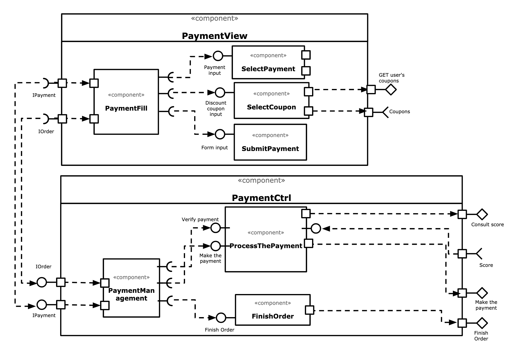

# Modelo para Apresentação do Lab05 - Subcomponentes e Páginas Dinâmicas

## Tarefa 1



## Tarefa 2

Link para o projeto no Codepen: [React 03 - Componente Barra](https://codepen.io/gportog/pen/GRZOyyK)

**HTML**
```html
<div id="root"></div>
```

**CSS**
```css
h2 {
  color: DarkBlue;
}

li {
  font-size: 20px;
}

li:hover {
  color: DarkBlue;
}
```

**JavaScript**
```javascript
class Barra extends React.Component {
  render() {
    let resultado = "";
    for (let b = 1; b <= this.props.tamanho; b++)
      resultado += "=";
    
    return <>
      <div>
      <p style={{color: this.props.cor}}>{resultado}</p>
      </div>
      </>
  }
}

class Lista extends React.Component {
  render() {
    return <>
      <div>
        <ul>
      {this.props.items.map((item, index) => {
            return (<li>{item}</li>);
      })}
          </ul>
      </div>
      </>
  }
}

let listaDino = ["T-Rex", "Velociraptor", "Estegossauro"];

const elemento = <div>
                   <h2>Dinossauros</h2>
                   <Barra tamanho="30" cor="red"/>
                   <Lista items={listaDino}/>
                 </div>
ReactDOM.render(elemento, 
        document.getElementById("root"));

```